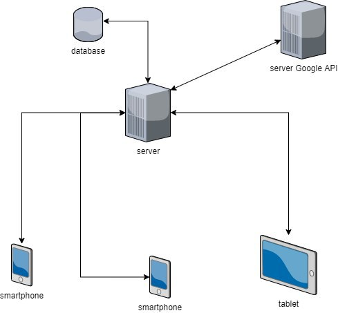
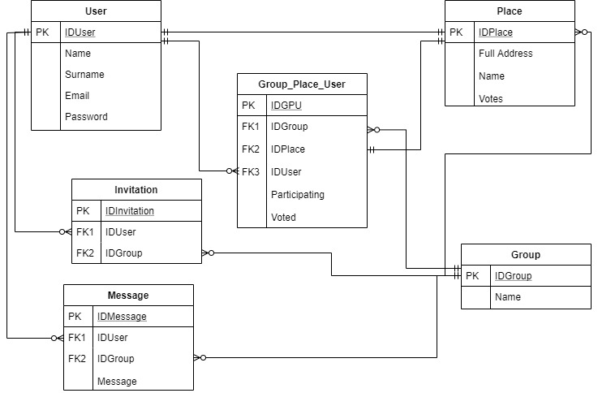
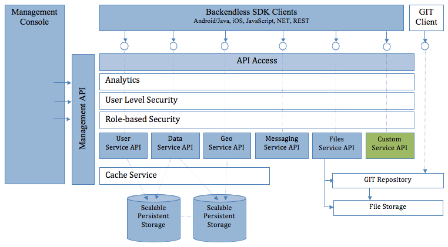

# Best Meeting Point - Wiki
## Group Members
*  Cimmino Fabio 807070
*  Lotterio Roberto 807500
*  Monti Simone 807994
*  Puleri Gianluca 807064

## Descrizione progetto
L’obiettivo del nostro progetto è quello di realizzare un App Android che consenta ad un gruppo di persone di organizzarsi agevolmente per incontrarsi. L’idea di questa App nasce dalla necessità, in un gruppo di persone che abitano più o meno lontano, di dover decidere il giorno ed il luogo (città e locale) in cui vedersi, venendo in contro alle esigenze e preferenze di tutti.

Quest’app rileverà le posizioni geografiche di ciascun utente e restituirà come risultato un’area (eventualmente parametrizzata rispetto a dimensioni desiderate) dove trovarsi.

L’utente potrà scegliere come recarsi nel luogo prestabilito (e.g. mezzi o auto), incrociando dati su traffico e mezzi pubblici e opzioni legate ai locali come le recensioni e il tipo (e.g. ristorante per cena o aperitivo).

## High Level Architecture

## Database Diagram

## Backendless Architecture

## Directories description
All'interno della directory principale `app` troviamo 4 sottocartelle, le quali contengono a loro volta altre sottocartelle:
* `manifests`, contiene un file `AndroidManifest.xml` nel quale è possibile inserire le varie activity che compongono l'applicazione e i vari permessi che l'utente deve concedere affinché essa funzioni correttamente.
* `java`, si compone di due sottocartelle:
   * `com.example.myapplication`, contiene le varie classi che compongono l'applicazione e si suddivide come segue:
      * `activity`, contiene le varie classi che costituiscono le possibili interazioni dell'utente con il sistema 
      * `adapter`, contiene le varie classi che si occupano della gestione dinamica della visualizzazione dei dati recuperati
      * `data`, contiene le varie classi che rappresentano il nostro modello di dati
      * `fragment`, contiene le varie classi interne ad una activity che costituiscono le possibili interazioni dell'utente con il sistema  
      * `parser`, contiene le varie classi che si occupano del parsing dei file `json` recuperati tramite API di Google
      * `utility`, contiene classi di vario genere utilizzate a supporto di altre classi
   * `com.example.myapplication (androidTest)`, contiene le varie classi di test realizzate
* `java (generated)`, contiene file di configurazione per la corretta esecuzione dell'app su Android Studio.
* `res`, si compone di diverse sottocartelle:
   * `drawable`, contiene le varie immagini all'interno dell'applicazione
   * `layout`, contiene vari file responsabili della parte grafica delle activity o fragment
   * `menu`, contiene il file responsabile della creazione del menu a scomparsa
   * `mipmap`, contiene il logo dell'applicazione in diversi formati e/o grandezze
   * `navigation`, contiene il file che si occupa della gestione dei vari fragment
   * `values`, contiene vari file utilizzati per la memorizzazione di variabili per la parte grafica

Inoltre, è di rilevante importanza notare la presenza di un file `build.gradle`, nel quale è possibile inserire le varie dipendenze del progetto ed altre varie impostazioni (e.g. compatibilità dell'app con le versioni Android).

## Come generare la documentazione
* In Android Studio, nella toolbar clicca su `Tools` e poi su `Generate JavaDoc`
* Inserisci la directory di destinazione e poi clicca su `OK`

## Come eseguire l'applicazione
* (opzionale) In Android Studio, crea un Android Virtual Device (AVD) per installare ed eseguire l'app
* Nella toolbar, seleziona il tuo dispositivo (o l'AVD appena creato) sul quale andare ad eseguire l'app
* Clicca il simbolo di `Run`

## Come eseguire i test
* Per testare tutti i metodi di una classe, fai click sul tasto destro sulla classe e clicca `Run`
* Per testare tutte le classi di test, fai click sul tasto destro sulla directory di test e clicca `Run Tests`